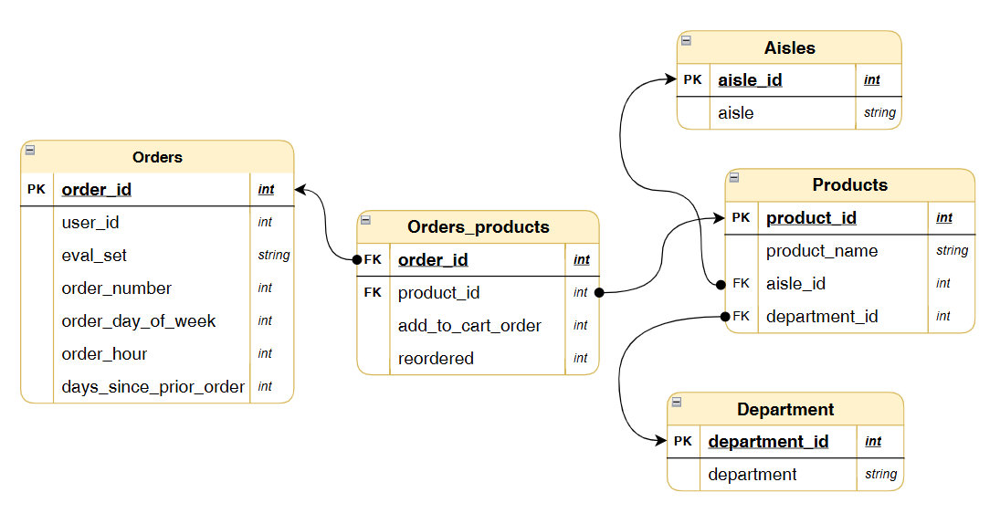

#  Instacart Market Basket Analysis

This project analyse customer purchasing behaviour using the **Instacart Grocery Shopping Dataset**, an open-source dataset released by **[Instacart](https://www.instacart.com/store/?categoryFilter=homeTabForYou)**, one of the largest online grocery delivery and pickup platforms in the United States.

The dataset contains grocery orders, purchased products, aisles and departments. It includes customer order history, product level transactions, shopping day, shopping hour, order sequence and reorder information, making it ideal for customer behaviour analysis and market basket analysis

This project explore customer shopping patterns, product popularity, basket composition and reorder behaviour to generate actionable business insights for retail and e-commerce.

## Data Preparation & Exploratory Data Analysis [Notebook]( https://github.com/Rahul-765/Instacart-Market-Basket-Analysis/blob/main/01_Data_Preparation_and_EDA.ipynb)

This notebook prepares the Instacart dataset for analysis by consolidating the original source tables, standardizing column names, validating data integrity and generating summary statistics. It establishes a clean and reliable analytical dataset containing customer, order, order product, aisle and department information, providing the foundation for all subsequent analyses.

#### orders: (3.4 million orders placed by 206k customers)
-	order_id: unique identifier for each order
-	user_id: unique identifier for the customer
-	eval_set: which evaluation set this order belongs in
-	order_number: order sequence number for user (1st to nth)
-	order_day_of_week: day of the week the order was placed on
-	order_hour: hour of the day order placed on
-	days_since_prior_order: days since previous order (where null for first order) 

#### orders_products: (33.8 million rows)
-	order_id: foreign key
-	product_id: foreign key
-	add_to_cart_order: Sequence in which the product was added to the cart
-	reordered: product has been ordered by this user in the past or not (1= yes or 0 = no)

#### products (49.6K products)
-	product_id: unique identifier for each product
-	product_name: name of the product 
-	aisle_id: foreign key
-	department_id: foreign key

#### aisles (134 aisle)
-	aisle_id: unique identifier for each ailse
-	aisle: name of the aisle

#### department (21 departments)
-	department_id: unique identifier for each department
-	department: name of the department 

### Data Modelling:

  

## Customer Behaviour Analysis [Notebook]( https://github.com/Rahul-765/Instacart-Market-Basket-Analysis/blob/main/02_Customer_Behaviour.ipynb)

This notebook explores customer purchasing behaviour by answering key business questions related to customer loyalty and shopping patterns. The analysis examines how customers are distributed by lifetime order count, identifies peak shopping days and hours, compares high-value customers with the average shopper, and measures customer lifespan to better understand long-term engagement.

| Finding | Number |
|---------|--------|
| Total customers analysed | **206,209** |
| Total orders analysed | **3,421,083** |
| Most common order frequency | **4–8 orders per customer lifetime** |
| Largest shopping frequency segment | **Monthly shoppers: 52.3% (107,897 customers)** |
| Peak shopping day | **Sunday, followed by Monday** |
| Peak shopping time | **6–9 PM, followed by 12–5 PM** |
| Largest lifespan bucket | **180–365 days: 41.1% of customers** |
| Customers active beyond 1 year | **<1% (1,568 customers)** |

> The typical Instacart customer remains active for **6–12 months**, shops **approximately once every 2–4 weeks**, and places **4–8 orders during their lifetime**. Shopping activity is occurring during the **6–9 PM evening window**, followed by 12–5 PM afternoons.

## Basket and Product Analysis [Notebook](https://github.com/Rahul-765/Instacart-Market-Basket-Analysis/blob/main/03_Basket_Product_Analysis.ipynb)

This notebook analyse shopping basket and product purchasing patterns to understand what customers buy. The analysis examines basket size across the customer journey, identifies the departments and aisles driving the highest sales and reorder rates, compares first-time and repeat shopping baskets, and highlights the products most frequently added first to the cart.

| Finding | Number |
|---------|--------|
| Total orders analysed | **3,346,083** |
| Total items sold | **33,819,106** |
| Average basket size | **10.11 items** per order |
| Basket size range | Min **1** item · Max **145** items |
| Top department by volume | **Produce** — highest order count and highest reorder rate |
| Top purchased product | **Banana** — most ordered product across all order stages |

> Basket size is remarkably stable at approximately **10 items per order** regardless of how many lifetime orders a customer has placed. \
> The 20 most purchased products are dominated entirely by fresh and organic produce. **Banana** ranks first. The first non-produce product in the ranking is Organic Whole Milk at position 10 with 142,813 purchases. Fresh fruits and vegetables account for the overwhelming majority of the top 20 by purchase volume. \
> Products most frequently added to the cart first represent the strongest purchase intent, indicating the items customers visit the platform specifically to buy. When these products also have high reorder rates, they become key drivers of long-term customer loyalty. \
> Overall, the analysis suggests that **fresh produce is at the core of the shopping experience**. Maintaining product availability, quality, and competitive pricing in this category is likely to have a greater impact on customer retention than promotional discounts in less frequently purchased departments.

## Reorder Analysis [Notebook](https://github.com/Rahul-765/Instacart-Market-Basket-Analysis/blob/main/04_Reorder_Analysis.ipynb)

This notebook investigates repeat purchasing behaviour to understand customer loyalty and product retention. The analysis measures how reorder rates change as customers place more orders, identifies the departments, aisles and products with the strongest repeat purchasing behaviour and segments customers based on the proportion of new versus repeat products in their shopping baskets.

| Finding | Number |
|---------|--------|
| Total items sold | **33,819,106** |
| Total reordered items | **19,955,360** |
| Overall reorder rate | **59.01%** — nearly 6 in every 10 items is a repeat purchase |
| Reorder rate — orders 1–10 | **42.4%** |
| Reorder rate — orders 11–20 | **69.2%** — largest single jump: +26.8 percentage points |
| Reorder rate — orders 31–40 | **79.0%** — approaching stability |
| Reorder rate — orders 70+ | **83–85%** — fully habitual |
| Fastest loyalty department | **Produce** — 61.7% reorder at orders 2–10, rising to 90.3% at orders 70+ |
| Slowest loyalty department | **Personal care** — 27.6% reorder at orders 2–10 |

> **59.01% of all items sold are reorders**, meaning the majority of Instacart purchasing is habitual rather than exploratory. The transition from orders 1–10 (42.4%) to orders 11–20 (69.2%) represents the largest shift in reorder behaviour across the entire customer journey and marks the primary habit formation window. \
> The reorder analysis confirms that **time and order frequency are the primary drivers of loyalty** - every department converges toward higher reorder rates given enough interactions. The most actionable insight is the concentration of 1,642,411 orders in the 1–10 range: the majority of the customer base is still in the habit-formation window, and this is where loyalty programme investment has the highest expected return.
